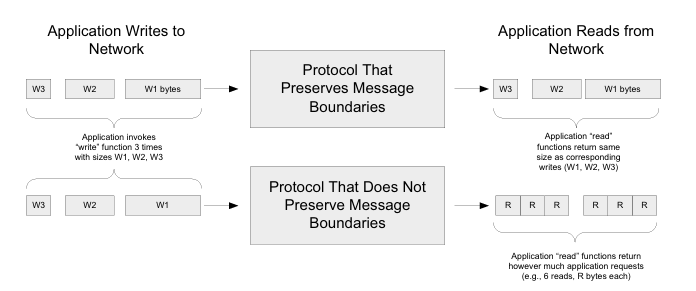
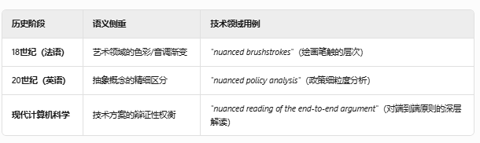

Packets, Connections, and Datagrams

1. 电话网络
   1. 建立环路（是不是电流不好说）
   2. 按环路使用时间+端点来计费,哪怕我们没有传递信息
   3. 提供带宽brandwidth和负载capacity来传递信息
   4. analog roots? 将模拟信号用数字信号提高了性能与可信赖度reliability
2. packet switching （分组交换）
   1. 来自不同的数据源或者发送者的chunks可以混在一起也可以稍后分离开来，称之为multiplexing（复用）
   2. chunks在旅途中可以从不同的switch中跳转，路径可以主动变换，这有两大优势
      1. 变得更耐用，设计者担心网络被人攻击
      2. 更具可用性，由于statistical mutiplexing (统计复用)
   3. 当packet被packet switch收到的时候，通常会放置在buffer或者队列中，以FCFS风格来处理
   4. 在统计复用中，流量基于流量的统计数据(arrival statistics)和时序模式来混合传输
   5. 这种方法的缺点在于可预测性较低——任何特定应用的性能表现，都取决于共享网络的其他应用的流量统计特性。
   6. 统计复用就像一个可以变道的高速，每一时刻的出口都有车出闸
   7. 时分复用（TDM）和静态复用等其他技术通常采用固定资源分配机制，会为每条连接预留特定的时隙或专用带宽资源。但是这样对带宽的利用率肯定是不足的
   8. 电路可以直接通过时分复用（TDM）技术实现，但虚拟电路（VC）——虽具有诸多电路特性却不依赖物理电路交换——可在面向连接的分组网络上实现。
      1. VCs专注于确定性和可靠性，具备高质量的效果
      2. VC这项技术不同于传统的物理依赖却具备多种传统电路的好的特性
      3. X.25协议正是基于这一技术原理，该协议在20世纪90年代初之前曾广为流行，随后逐渐被帧中继（Frame Relay）取代，并最终演进为支持互联网接入的数字用户线（DSL）技术和电缆调制解调器（详见第3章）。
   9. 虚拟电路（VC）抽象层与X.25等面向连接的分组网络要求每个交换机为每条连接保存特定信息或状态。这是因为每个数据包仅携带少量开销信息（作为状态表的索引标识）。例如在X.25中，12比特的逻辑信道标识符（LCI）或逻辑信道号（LCN）就承担了这一功能。每个交换机通过LCI/LCN结合本地存储的流状态信息，确定数据包的下一跳转发路径。
      1. LCI是全局的，相当于快递单
      2. LCN则是像分拣中心内部编号（本地简化：`仓库A-货架3-格子5`）
      3. 当某交换机故障时，只需重新协商LCN
   10. 虚电路（VC）上的每条流状态均需通过**信令协议**预先建立，该协议支持连接创建、拆除及状态信息同步。因此，这类网络被称为**面向连接型网络**。
       1. 但是面向连接并不意味着VC
       2. VC是网络层的技术
       3. TCP是传输层的技术
   11. 长期以来，面向连接的网络（无论基于电路交换还是分组交换）始终是网络技术的主流形式。20世纪60年代末，另一种技术方案应运而生——**数据报（datagram）**。该概念最早可追溯至CYCLADES网络系统[P73]，其本质是一种特殊的分组格式：所有标识信息（包括源地址和最终目的地址）均内嵌于数据报内部（而非存储在分组交换机中）。
       1. 数据报（特殊的packet）在网络层就知道目的地
       2. packet只知道下一条的位置，具体要达到目的地则需要更高层的抽象来处理
       3. 尽管这意味着更长的packet,但是这也意味着无需pre-connection的connectionless网络，省去了复杂的信令协议
   12. 其他相关的概念是消息边界(message boundaries)和record markers (记录标志) 
       1. 应用程序通过协议传输消息时，消息边界即两次写入操作之间的字节偏移量。
          1. 保留消息边界的协议（如图左侧）会在接收端明确标识发送方的原始消息边界；
          2. 而不保留边界的协议（如TCP等流式协议，如图右侧）则会忽略该信息，接收端无法感知原始消息划分。因此，若需维持消息边界，应用程序需自行实现边界标识机制
          3. 大多数数据报协议会保留消息边界。
       2. 但在电路交换或虚电路（VC）网络中，发送方可能写入多个数据块，接收方却会将其合并为不同大小的数据块一次性读取——这类协议不保留消息边界。**若底层协议无法保留边界而应用又需要该特性时，应用程序必须自行实现边界标识机制。**

The End-to-End Argument and Fate Sharing 

1. 在设计操作系统或协议套件等大型系统时，常需决策特定功能应部署(be placed)在哪个层级。这一问题的核心指导原则是**端到端原则（end-to-end argument）**

   1. The function in question : 当前讨论的功能

   2. 所讨论的功能，唯有借助通信系统端点应用程序的协同参与，方能完整且正确地实现。

      > The function in question can completely and correctly be implemented only with  the knowledge and help of the application standing at the end points of the com munication system. 

   3. 因此，若要将该功能完全交由通信系统原生实现，实不可行。（尽管通信系统提供的部分实现有时可作为性能优化手段。）

      > Therefore, providing that questioned function as a feature of  the communication itself is not possible. (Sometimes an incomplete version of the  function provided by the communication system may be useful as a performance  enhancement.

   4. 简单来说，这个原则就是大系统的重要的功能不应当在低层级实现，尽管后者可以为功能实现减轻负担以及优化性能做出努力

      1. ### Nuanced：源自拉丁语 *"nubes"*（云），隐喻色彩/明暗的渐变层次

         

   5. 端到端原则倾向于支持一种设计，即网络本身保持“愚钝”，而连接到网络的系统则更“聪明”。在 TCP/IP 的设计中我们正是看到这种模式，许多功能（例如：确保数据不丢失的方法、控制发送方发送速率的机制）都是在终端主机中实现的，而这些主机运行着具体的应用程序。至于哪些功能应当集中实现于同一台计算机、网络或软件栈中，这是另一个相关设计原则“命运共享”的主题。
   
   6. 命运共享原则建议将维持一个活跃通信关联（例如虚拟连接）所需的全部状态信息，放置在与通信端点相同的位置。
   
      1. **容错性强**：如果网络中的某个路由器或交换机发生故障，不会导致连接状态丢失，因为状态保存在端点；
      2. **与端到端原则一致**：端系统负责关键控制逻辑，网络保持简单。
   
   7. 按照这种推理，唯一会破坏通信的失败类型，是那些同时摧毁一个或多个通信端点的失败，而这类失败显然无论如何都会导致整个通信的终止。
   
   8. 命运共享是这样一种设计理念，它使得虚拟连接（例如由 TCP 实现的连接）即便在网络内部的连接暂时中断（在一个适度的时间范围内）时，仍能保持活跃状态。
   
      1. TCP 的连接状态（如序列号、确认号、重传机制等）是由通信两端各自维护的。这意味着，即使网络中途出现了暂时性故障（例如路由变化、链路中断几秒钟），只要最终路径恢复，通信就能继续进行，不需要重建连接。
   
   9. 命运共享同样支持一种“愚钝的网络，智能的端主机”模型。而在当今的互联网中，关于哪些功能应由网络承担、哪些功能不应由网络承担，始终存在着持续的争论。
   
      1. ongoing tension 不指冲突，而是指长期存在尚未解决的分歧
      2. TCP 的拥塞控制在端主机；
      3. 但一些现代网络（如 MPLS、5G）又倾向将部分控制逻辑下放到网络中（如 QoS、路径优化）；
      4. 中间件如 NAT、防火墙、负载均衡器等也是“智能网络”理念的体现。

Error Control and Flow Control

1. 在某些情况下，网络中的数据会遭到破坏或丢失。这可能由多种原因造成，例如硬件故障、在传输过程中辐射导致比特被修改、处于无线网络的信号覆盖范围之外，以及其他因素。应对这些错误的过程被称为差错控制（error control），它可以在构成网络基础设施的系统中实现，也可以在连接到网络的终端系统中实现，或者两者结合。

