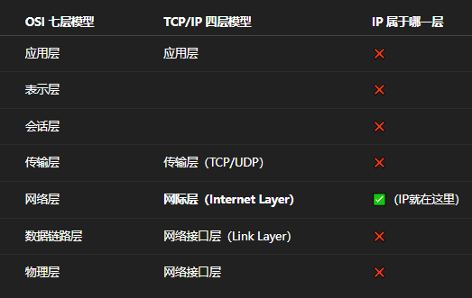
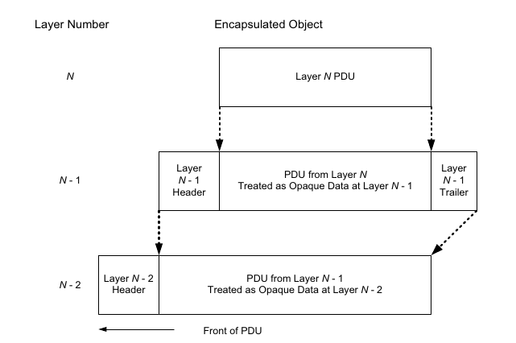
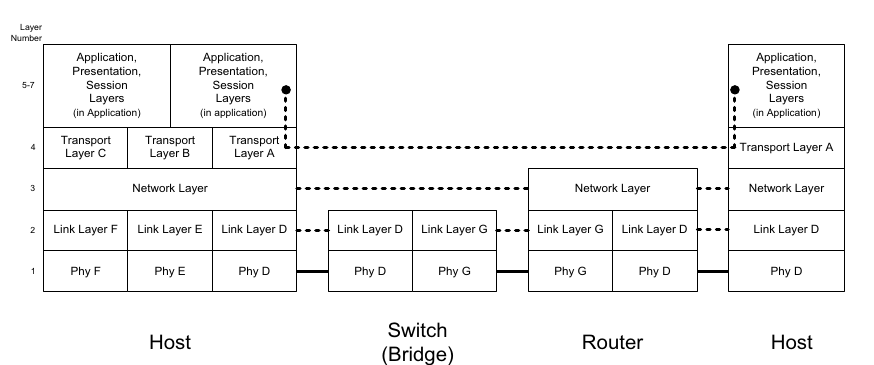

Packets, Connections, and Datagrams

1. 电话网络
   1. 建立环路（是不是电流不好说）
   2. 按环路使用时间+端点来计费,哪怕我们没有传递信息
   3. 提供带宽brandwidth和负载capacity来传递信息
   4. analog roots? 将模拟信号用数字信号提高了性能与可信赖度reliability
2. packet switching （分组交换）
   1. 来自不同的数据源或者发送者的chunks可以混在一起也可以稍后分离开来，称之为multiplexing（复用）
   2. chunks在旅途中可以从不同的switch中跳转，路径可以主动变换，这有两大优势
      1. 变得更耐用，设计者担心网络被人攻击
      2. 更具可用性，由于statistical mutiplexing (统计复用)
   3. 当packet被packet switch收到的时候，通常会放置在buffer或者队列中，以FCFS风格来处理
   4. 在统计复用中，流量基于流量的统计数据(arrival statistics)和时序模式来混合传输
   5. 这种方法的缺点在于可预测性较低——任何特定应用的性能表现，都取决于共享网络的其他应用的流量统计特性。
   6. 统计复用就像一个可以变道的高速，每一时刻的出口都有车出闸
   7. 时分复用（TDM）和静态复用等其他技术通常采用固定资源分配机制，会为每条连接预留特定的时隙或专用带宽资源。但是这样对带宽的利用率肯定是不足的
   8. 电路可以直接通过时分复用（TDM）技术实现，但虚拟电路（VC）——虽具有诸多电路特性却不依赖物理电路交换——可在面向连接的分组网络上实现。
      1. VCs专注于确定性和可靠性，具备高质量的效果
      2. VC这项技术不同于传统的物理依赖却具备多种传统电路的好的特性
      3. X.25协议正是基于这一技术原理，该协议在20世纪90年代初之前曾广为流行，随后逐渐被帧中继（Frame Relay）取代，并最终演进为支持互联网接入的数字用户线（DSL）技术和电缆调制解调器（详见第3章）。
   9. 虚拟电路（VC）抽象层与X.25等面向连接的分组网络要求每个交换机为每条连接保存特定信息或状态。这是因为每个数据包仅携带少量开销信息（作为状态表的索引标识）。例如在X.25中，12比特的逻辑信道标识符（LCI）或逻辑信道号（LCN）就承担了这一功能。每个交换机通过LCI/LCN结合本地存储的流状态信息，确定数据包的下一跳转发路径。
      1. LCI是全局的，相当于快递单
      2. LCN则是像分拣中心内部编号（本地简化：`仓库A-货架3-格子5`）
      3. 当某交换机故障时，只需重新协商LCN
   10. 虚电路（VC）上的每条流状态均需通过**信令协议**预先建立，该协议支持连接创建、拆除及状态信息同步。因此，这类网络被称为**面向连接型网络**。
       1. 但是面向连接并不意味着VC
       2. VC是网络层的技术
       3. TCP是传输层的技术
   11. 长期以来，面向连接的网络（无论基于电路交换还是分组交换）始终是网络技术的主流形式。20世纪60年代末，另一种技术方案应运而生——**数据报（datagram）**。该概念最早可追溯至CYCLADES网络系统[P73]，其本质是一种特殊的分组格式：所有标识信息（包括源地址和最终目的地址）均内嵌于数据报内部（而非存储在分组交换机中）。
       1. 数据报（特殊的packet）在网络层就知道目的地
       2. packet只知道下一条的位置，具体要达到目的地则需要更高层的抽象来处理
       3. 尽管这意味着更长的packet,但是这也意味着无需pre-connection的connectionless网络，省去了复杂的信令协议
   12. 其他相关的概念是消息边界(message boundaries)和record markers (记录标志) 
       1. 应用程序通过协议传输消息时，消息边界即两次写入操作之间的字节偏移量。
          1. 保留消息边界的协议（如图左侧）会在接收端明确标识发送方的原始消息边界；
          2. 而不保留边界的协议（如TCP等流式协议，如图右侧）则会忽略该信息，接收端无法感知原始消息划分。因此，若需维持消息边界，应用程序需自行实现边界标识机制
          3. 大多数数据报协议会保留消息边界。
       2. 但在电路交换或虚电路（VC）网络中，发送方可能写入多个数据块，接收方却会将其合并为不同大小的数据块一次性读取——这类协议不保留消息边界。**若底层协议无法保留边界而应用又需要该特性时，应用程序必须自行实现边界标识机制。**

The End-to-End Argument and Fate Sharing 

1. 在设计操作系统或协议套件等大型系统时，常需决策特定功能应部署(be placed)在哪个层级。这一问题的核心指导原则是**端到端原则（end-to-end argument）**

   1. The function in question : 当前讨论的功能

   2. 所讨论的功能，唯有借助通信系统端点应用程序的协同参与，方能完整且正确地实现。

      > The function in question can completely and correctly be implemented only with  the knowledge and help of the application standing at the end points of the com munication system. 

   3. 因此，若要将该功能完全交由通信系统原生实现，实不可行。（尽管通信系统提供的部分实现有时可作为性能优化手段。）

      > Therefore, providing that questioned function as a feature of  the communication itself is not possible. (Sometimes an incomplete version of the  function provided by the communication system may be useful as a performance  enhancement.

   4. 简单来说，这个原则就是大系统的重要的功能不应当在低层级实现，尽管后者可以为功能实现减轻负担以及优化性能做出努力

      1. ### Nuanced：源自拉丁语 *"nubes"*（云），隐喻色彩/明暗的渐变层次

         

   5. 端到端原则倾向于支持一种设计，即网络本身保持“愚钝”，而连接到网络的系统则更“聪明”。在 TCP/IP 的设计中我们正是看到这种模式，许多功能（例如：确保数据不丢失的方法、控制发送方发送速率的机制）都是在终端主机中实现的，而这些主机运行着具体的应用程序。至于哪些功能应当集中实现于同一台计算机、网络或软件栈中，这是另一个相关设计原则“命运共享”的主题。
   
   6. 命运共享原则建议将维持一个活跃通信关联（例如虚拟连接）所需的全部状态信息，放置在与通信端点相同的位置。
   
      1. **容错性强**：如果网络中的某个路由器或交换机发生故障，不会导致连接状态丢失，因为状态保存在端点；
      2. **与端到端原则一致**：端系统负责关键控制逻辑，网络保持简单。
   
   7. 按照这种推理，唯一会破坏通信的失败类型，是那些同时摧毁一个或多个通信端点的失败，而这类失败显然无论如何都会导致整个通信的终止。
   
   8. 命运共享是这样一种设计理念，它使得虚拟连接（例如由 TCP 实现的连接）即便在网络内部的连接暂时中断（在一个适度的时间范围内）时，仍能保持活跃状态。
   
      1. TCP 的连接状态（如序列号、确认号、重传机制等）是由通信两端各自维护的。这意味着，即使网络中途出现了暂时性故障（例如路由变化、链路中断几秒钟），只要最终路径恢复，通信就能继续进行，不需要重建连接。
   
   9. 命运共享同样支持一种“愚钝的网络，智能的端主机”模型。而在当今的互联网中，关于哪些功能应由网络承担、哪些功能不应由网络承担，始终存在着持续的争论。
   
      1. ongoing tension 不指冲突，而是指长期存在尚未解决的分歧
      2. TCP 的拥塞控制在端主机；
      3. 但一些现代网络（如 MPLS、5G）又倾向将部分控制逻辑下放到网络中（如 QoS、路径优化）；
      4. 中间件如 NAT、防火墙、负载均衡器等也是“智能网络”理念的体现。

Error Control and Flow Control

1. 在某些情况下，网络中的数据会遭到破坏或丢失。这可能由多种原因造成，例如硬件故障、在传输过程中辐射导致比特被修改、处于无线网络的信号覆盖范围之外，以及其他因素。应对这些错误的过程被称为差错控制（error control），它可以在构成网络基础设施的系统中实现，也可以在连接到网络的终端系统中实现，或者两者结合。

2. 应对这些错误的过程被称为差错控制（error control），它可以在构成网络基础设施的系统中实现，也可以在连接到网络的终端系统中实现，或者两者结合。而从端到端原则和命运共享原则来看，自然地，它们会建议将差错控制实现于靠近应用程序的地方，或直接在应用程序中。

   1. 以太网在链路层做了CRC校验，但它只覆盖一跳，无法覆盖整个通信路径
   2. TCP在端到端做了校验和和重传机制，即使中间链路发生错误也能保障通信。

3. 通常情况下，如果只需关注少量比特错误，可以使用一些数学编码方法，在数据接收时或传输过程中对比特错误进行检测和修复

   1. 谓“数学编码”通常指差错检测与纠正编码（Error Detection and Correction Codes），例如：
      - 奇偶校验（Parity Bit）
      - CRC（循环冗余校验）
      - 汉明码（Hamming Code）
      - Reed-Solomon 编码等
   2. 这些编码可以：
      - 在接收端识别是否发生了错误；
      - 某些还能直接修复少量错误（如 1~2 bit 错误）；
      - 在某些系统中，还可边传输边校验，例如使用 FEC（前向纠错）技术。

4. 这类任务（指轻微比特错误的处理，如CRC）通常由网络内部例行执行。当在包交换网络中发生更严重的损坏时，通常会对整个数据包进行重发。在电路交换或虚电路交换（如 X.25）网络中，重传往往发生在网络内部。对于那些要求数据严格按序且无差错传输的应用，这种方式可能效果良好；但也有一些应用并不需要这样的能力，也不希望承担（如建立连接和可能的重传延迟等）为实现可靠传输所带来的成本。

   1. 在 X.25 或类似的 VC-switched 网络 中：

      - 网络内维护连接状态；
      - 网络负责检测并重传错误数据；
      - 优点是对应用透明，保证了可靠性；
      - 缺点是成本高，如连接建立延迟、重传带来的延时、资源消耗。

      与之相对的，现代 TCP/IP 网络中的包交换策略：

      - 尽量让错误控制推给端系统（如 TCP 的端到端重传）；
      - 某些应用（如视频流、VoIP）甚至宁愿接受部分丢包，也不想承担重传延迟，因为实时性更重要。

5. 即使是一个可靠的文件传输应用，其实也并不真正关心文件数据块是以什么顺序传送的，只要最终能够确认所有数据块都无差错地传输到了，并且可以重新组装回原始的顺序即可。

   1. 这句话强调了一个很重要的点：
      - 传输顺序 vs. 结果完整性：
         某些应用（如文件传输）最终关注的是数据的完整和准确，并不要求传输过程中必须“按序到达”。
      - 重组由接收端完成：
         比如 FTP 等协议可以处理乱序到达的文件块，只要全部块都传完、无错误，就可以正确重组出原始文件。
      - 这与“流式应用”不同：
         视频播放、音频对话这类实时应用更在意数据顺序，而不是完全准确；而文件传输则相反。
   2. 有时可以牺牲传输顺序换取效率，而顺序控制可以交由应用或上层协议处理。

6. 尽力而为传输（best-effort delivery），这是与“可靠、有序传输”相对的一种网络服务模型。

   1. 作为一种替代于在网络中实现可靠、按序传输所带来的开销的方法，另一种被 Frame Relay 和 IP 协议采纳的服务类型是“尽力而为传输”（best-effort delivery）。
   2. 在这种方式下，网络不会投入太多精力去确保数据能够无差错、无遗漏地传输。某些类型的错误通常通过差错检测码或校验和来发现，比如那些会影响数据报传送方向的错误；但一旦检测到此类错误，出错的数据报就会被直接丢弃，不会采取进一步处理措施。

7. 如果尽力而为的传输成功，那么一个高速发送方可能会以超过接收方处理能力的速率产生数据。在基于尽力而为的 IP 网络中，限制发送方速率是通过在网络之外、通信系统更高层中的流量控制机制 flow control mechanisms 来实现的。

   1. 解决办法不是由 IP 层提供：IP 层不进行速率管理。

   2. IP层 = TCP/IP 模型中的 Internet Layer（网际层）

   3. “IP层”是一个术语上的简化表达，指的是 IP 协议所在的那一层。他负责

      

      1. 分配与管理 IP 地址；
      2. IP 数据报的封装与路由；
      3. 协议：IPv4、IPv6、ICMP、ARP（部分归于 link 层）

8. 这与端到端原则是一致的：TCP 位于终端主机中，负责速率控制。它也与命运共享原则相符：这种做法允许网络基础设施中的某些组件发生故障，而不会必然影响网络外部设备之间的通信能力（只要仍有某条通信路径保持可用）。

Design and Implementation

1. 尽管协议架构可能暗示某种实现方式，但它通常并不强制规定。因此，我们需要区分“协议架构”和“实现架构”：
   1. 协议架构定义了某一通信体系的概念性结构，
   2. 而实现架构则定义了如何将这些概念具体实现出来，通常是以软件的形式。
   3. “include a mandate” 是技术写作中常用的中性表达，表示某项规范或架构是否明确规定了必须执行的行为，同时保留语义的灵活性与客观性。这里没直接使用mandate作为动词就是处于这个原因
   4. “Consequently” 表示逻辑上的“因此、所以”，强调：前一句话的事实，直接导致了我们采取某个做法或观点的必要性。这里用它，要比`so,then`要更为正式
   5.  be rendered into existence 来描述implement architecture 将概念转化为实现的动作
2. 许多负责实现 ARPANET 协议的工程师都熟悉操作系统的软件结构。而一篇具有影响力的论文，描述了 “THE” 多道程序设计系统 [D68]，它主张使用一种分层结构，以此来应对验证大型软件实现的逻辑健全性Soundnesss与正确性Correctness的问题。
   1. 比较correctness和soundness的区别
      1. Correctness：你写出来的系统（代码）做了你想让它做的事情（行为符合规范）。 是否符合预期
      2. Soundness:  你证明这个系统没问题的方法是可靠的，不会证明一个实际上是错的东西为对。说得通
3. 最终，这促成了一种网络协议的设计哲学，即在实现（和设计）中引入多层结构。这种方法现在被称为分层（layering），并已成为实现协议族的常见方式。
   1. 网络协议之所以采用分层，是历史积累和工程实践共同推动的结果，它源于早期操作系统分层结构的成功经验**，**并最终内化为现代网络协议设计的核心哲学

layering

1. 采用分层结构后，每一层负责通信过程中的不同方面。分层设计的好处在于：它允许开发者将系统的不同部分**独立地进行演进和修改**，这些部分通常由**不同的人**，具备**不同领域的专业知识**来分别开发。

2. 协议分层中最常被提及的概念，基于一个名为“开放系统互联”（OSI）模型的标准 [Z80]，该标准由国际标准化组织（ISO）制定。

3. 尽管 OSI 模型认为，为了实现协议架构的模块化，七个逻辑层是理想的选择，但 TCP/IP 架构通常被认为由五层组成。在 1970 年代早期，人们曾围绕 OSI 模型与其前身——ARPANET 模型——各自的优劣展开了大量争论。

4. 尽管说 TCP/IP 最终“胜出”也许是公允的，但来自 ISO 协议族（即遵循 OSI 模型并由 ISO 标准化的一组协议）的一些理念，甚至整个协议，仍被采纳用于 TCP/IP 体系中。

5. OSI 七层模型

   1. 第1层：物理层（Physical Layer）——定义比特如何在物理介质上传输，如电压、接头、速率。代表技术有 Ethernet 1000BASE-T、V.92、SONET/SDH。

   2. 第2层：数据链路层（Data Link Layer）——负责同一链路内的帧传输、MAC地址、差错检测。典型协议有以太网、Wi-Fi、HDLC。

      1. 链路层（或称数据链路层）包含用于在共享同一通信介质的相邻节点之间建立连接的协议与方法。
      2. 有些链路层网络（例如 DSL）只连接两个相邻节点。
      3. 而当多个节点可以同时访问同一个共享网络时，这种网络被称为多路访问网络（multi-access network）。Wi-Fi 和以太网就是这种多路访问链路层网络的例子，需要特定协议来协调在任意时刻由哪一个站点访问共享介质。
      4. 我们将在第 3 章中讨论这些内容。
      5. 主要负责“点到点”或“点到多点”的直接相邻连接；

   3. 第3层：网络层（Network Layer）——负责多跳路径转发与逻辑寻址。代表协议有 IP、X.25、CLNP。

      1. 网络层（或称网际层）是我们非常关注的一层。
      2. 对于像 TCP/IP 这样的分组网络，它提供一种可互操作的数据包格式，可以在不同类型的链路层网络之间传递。
      3. 该层还包括一套用于主机的寻址机制，以及路由算法，用于决定数据包从一台机器发送到另一台机器时应当经过哪条路径。

   4. 第4层：传输层（Transport Layer）——提供端到端连接与可靠性，如TCP的重传、流量控制。常见协议有 TCP、UDP、TP4。

      1. 在第 3 层之上，我们可以看到一些协议（至少在理论上）只由终端主机实现，其中包括传输层。

      2. 这也是我们非常关注的一层，因为它在不同会话之间提供了一个数据传输通道，而且其复杂程度可能会很高，具体取决于它所提供的服务类型（例如，在可能丢包的分组网络中实现可靠传输）。

         1. “only by end hosts”：

            - 传输层协议（如 TCP、UDP）并不由路由器、中间设备处理，而是完全在通信双方的操作系统中实现；
            - 这体现了端到端原则（End-to-End Principle）。

         2. “provides a flow of data between sessions”：

            - 传输层是连接“应用层会话”与“网络层通信”的中介；
            - 它将应用的数据分段，并管理多个并发连接（如多个 HTTP 请求）；
            - 提供端对端的“数据流”语义（例如 TCP 提供一个可靠、有序、字节流接口）。

            “quite complex... depending on services”：

            - UDP 很简单，无连接、无确认、无重传；
            - TCP 很复杂，包括序列号、ACK、重传、流量控制、拥塞控制、窗口滑动等；
            - 如果还加上 TLS 加密，复杂度进一步上升。

   5. 第5层：会话层（Session Layer）——管理会话状态，如建立、维护、重启连接。代表协议有 X.225。

      1. 会话层表示应用程序之间正在进行的交互（例如，在 Web 登录会话中使用 cookie 的场景）。会话层协议可能提供的能力包括连接的建立与重启，以及检查点机制（即保存目前已完成的工作进度）。
      2. 管理长时间持续的应用交互状态；
      3. 功能包括：
         - 会话建立 / 维护 / 恢复；
         - 检查点（checkpointing）：断点续传、自动保存；
      4. 举例：
         - 登录状态维持（如 cookie、token）；
         - 远程桌面中断恢复；
         - 数据库连接池中的连接复用。

   6. 第6层：表示层（Presentation Layer）——处理数据格式转换、加密、压缩等。功能如字符集转换、TLS 加解密。

      1. 在会话层之上是表示层，它负责信息的格式转换和标准编码。
      2. 关注数据“语义”层面的兼容；
      3. 功能包括：
         - 数据格式转换（如 XML ↔ JSON、EBCDIC ↔ ASCII）；
         - 编解码（如 JPEG、MP3）；
         - 加解密（如 TLS 的数据加密）；
      4. 实际上大多数编解码行为都由应用实现，或通过库支持。

   7. 第7层：应用层（Application Layer）——面向用户的通信接口，支持实际业务交互。协议如 FTP、HTTP、SMTP、Skype。

      1. 应用通常会实现各自的应用层协议，这些协议也是用户最常接触到的。应用层协议种类繁多，程序员也在不断地发明新的协议。因此，应用层是创新最多、能力扩展最活跃的地方，新的功能大多在此层被开发和部署。
      2. 没有统一标准强制开发者使用某一套；例如：
         1. Web 浏览器使用 HTTP、HTTPS；
         2. 邮件客户端使用 SMTP、IMAP、POP3；
         3. 聊天应用可能使用 WebSocket、自定义 JSON 协议等。
      3. 最贴近用户，也最容易感知：
         - 用户操作的是应用界面，但其背后通信依赖的是应用层协议；
         - 例如用户点击“登录”，其实就是发出一个 HTTPS 请求（应用层 + 安全层）。
      4. 创新与扩展主要发生在应用层：
         - 原因是：无需修改内核或操作系统即可开发和部署；
         - 常见新协议：
           - REST、GraphQL（比传统 HTTP 更灵活）；
           - gRPC、QUIC（优化传输效率）；
           - Matrix（加密聊天）、ActivityPub（联邦社交）等。

   8. 正如我们将看到的，互联网协议栈并不包括正式的会话层或表示层协议，因此这些功能如果需要，通常由应用程序自行实现。

Multiplexing, Demultiplexing, and Encapsulation in Layered Implementations 

1. 分层架构的一大主要优势，是它天然具备协议复用（multiplexing）的能力。这种复用方式允许多个不同的协议在同一套基础设施上共存。它还允许同一协议的多个实例（例如多个连接）被同时使用，而不会相互混淆。

   1. protocol multiplexing（协议复用）：
      - 这里的复用指的是：多个高层协议可以共享同一个底层通信机制；
      - 典型例子：
        - IP 层通过 协议字段（Protocol field） 区分上层是 TCP、UDP 还是 ICMP；
        - TCP 通过 端口号 区分多个不同应用或连接；
        - HTTP/1.1 或 HTTP/2 可在一个 TCP 连接中复用多个请求。
   2. 同一协议的多实例（instantiations）：
      - 比如：
        - 一台设备可以同时建立多个 TCP 连接（每个用一个 4 元组标识）；
        - 一个浏览器可以同时访问多个网页服务器；
      - 协议设计中必须支持“上下文隔离”，避免混淆。
   3. “on the same infrastructure”：
      - 不需要为每个协议或服务建立一套新的物理或逻辑通道；
      - 网络只需要一套通用“承载层”，上层协议可以灵活叠加。
   4. 分层结构带来的最大工程好处之一，是复用与隔离的能力：不同协议可以共存，一个协议的多个连接也可以同时存在且互不干扰，这使网络既灵活又可扩展。

2. 复用（multiplexing）可以发生在协议栈的不同层次，每一层都会使用不同类型的标识符来确定某个协议或信息流属于哪一组。例如，在链路层，大多数链路技术（如以太网和 Wi-Fi）在每个数据包中都会包含一个协议标识字段，用于指示该链路层帧中承载的是哪种协议（IP 就是其中之一）。 

   1. 注意这里说的是"承载的"，而非用的是。链路层可用不上网络层的IP协议

   

3. 在图 1-3 中，每一层都有其对应的消息对象概念（即 PDU，协议数据单元），这一对象与该层负责创建的数据结构相对应。例如，如果第 4 层（传输层）协议生成了一个数据包，它就被正确地称为 **第 4 层 PDU**，或 **传输层 PDU（TPDU）**。

   1. 当某一层接收到来自上一层的 PDU 时，它通常**“承诺”不去解析该 PDU 的内容**。这正是封装的本质——每一层都将来自上一层的数据视为**不透明、不可解释的信息**。最常见的做法是，在该 PDU 前面添加当前层的**首部（header）**，尽管某些协议也使用尾部（trailer）（但在 TCP/IP 中并不使用）。
   2. 首部用于**在发送端进行多路复用**，而在接收端则根据其中的**解复用标识符（demux identifier）\**来执行解复用操作。在 TCP/IP 网络中，这类标识符通常包括\**硬件地址、IP 地址、端口号**等。首部中也可能包含一些重要的状态信息，例如是否正在建立一个虚电路，或虚电路是否已经建立完成。
   3. 现代网络系统**出于性能、安全、管理等原因**，**确实会解析上层 PDU**，这叫做：协议穿透或者说深度包检测（Deep packet inspection）

4. 在“纯粹的分层架构”中，**并不是所有的网络设备都必须实现所有层次**。图 1-4 展示了这样一种情况：某些设备如果只承担特定类型的处理任务，那它们只需要实现协议栈中的**部分层级**。

   1. 如果一个设备只实现部分协议层，那它是否必须从“下往上”连续实现这些层？

      1. 为什么通常必须是“从下往上”的连续层？
         1. 你必须能**解开下层头部，才能正确定位并处理上层数据**；
         2. 举例来说，如果你想理解 IP 层内容，你必须先能解析数据链路层（如 Ethernet）的帧头，找到里面的 EtherType，然后才能知道后面是 IP；
         3. 如果你不会处理下层，你**甚至无法提取上层数据是哪一层的 PDU，更谈不上处理它了**。

      2. 反例思考：能不能“跳层”直接处理上层？理论上你**可以跳过某些层的逻辑**，但你必须能**识别并跳过那层的数据结构**。比如：
         1. **DPI（深度包检测）设备**可能不理解 TCP 的窗口控制，但它知道怎么从 IP 包中提取 TCP payload；
         2. **Wireshark** 不运行协议栈，但能“跳层”分析上层数据结构，是因为它知道每层的格式；
         3. 所以它们不是“实现了那些协议”，而是“能读懂数据格式”——这更像是**解析器，而非协议栈实现者**。
      3. **一个网络设备若想“有效地处理”某一层的协议逻辑，必须从链路层起，向上连续实现至该层。**
          **如果只是“转发”或“观察”数据而不处理协议逻辑，则可以“跳层”解析或透明转发。**

5. 在图 1-4 中，一个略显理想化的小型互联网系统包括两个终端系统、一台交换机和一台路由器。在该图中，每一个编号都对应于某一特定层次上的一种协议。如图所示，每个设备实现的是协议栈中不同的子集。

   1. 图中左侧的主机实现了三种不同的**链路层协议（D、E 和 F）**，每种对应一个物理层协议，并且还实现了三种**传输层协议（A、B 和 C）**，它们共用一种网络层协议。终端主机实现了全部层次；交换机实现到第 2 层（该交换机支持 D 和 G 两种链路层协议）；而路由器实现到第 3 层。

      

   2. **链路层与物理层通常是配套出现的，尤其在现实硬件和标准协议中是绑定定义的。**
       **但在抽象协议结构中，它们是逻辑上分层的，且在一些系统中可以交叉重用或虚拟化。**

      1. 实际工程中：**链路层和物理层通常成对绑定出现**

         | 协议/标准 | 物理层                  | 链路层                    |
         | --------- | ----------------------- | ------------------------- |
         | Ethernet  | 电缆（双绞线、光纤）    | MAC帧结构 + CSMA/CD       |
         | Wi-Fi     | 无线电波（2.4GHz/5GHz） | 帧结构 + CSMA/CA + 管理帧 |
         | PPP       | 串行线（如DSL）         | 点对点封装、握手、校验    |
         | USB       | 铜线（短距离）          | 主从时序 + CRC + ACK      |

         1. 链路层需要知道物理层**一帧能发多长、发多快、是否可靠**；
         2. 物理层则需要链路层**告诉它什么时候发、发给谁、发送多少**；
         3. 所以两者通常由**同一套标准共同规定**，例如 IEEE 802.3（以太网）。

      2. 例外情况：可**分离复用** , 尽管通常配套，但**链路层和物理层可以拆分、重用**，例如：

         1. **PPP over Ethernet（PPPoE）**：

            - 用以太网的物理层承载 PPP 链路层封装；

         2. ~~**IP over InfiniBand**：~~  IPoIB实际上是网络层和链路层的分离复用

            - ~~IP 协议运行在 InfiniBand 的链路层之上，跨越常规 TCP/IP 栈；~~

         3. **虚拟网络（如 VXLAN、TUN/TAP）**：

            - 软件模拟链路层逻辑，物理层可能是普通 IP 网络。

            - TAP 的设计愿望：为了解决什么问题？

              - 虚拟机与容器网络接入

                - 虚拟机需要像实体主机一样拥有网卡；

                - TAP 提供一个内核态虚拟网卡，可以和 QEMU、Docker、LXC 等对接；
                - 这样虚拟机发出的帧就能像真主机一样被处理和转发。

              - 用户空间网络协议栈开发、测试

                - 开发者可以写程序直接处理 Ethernet 帧，不需要自己造驱动或真网卡；
                - TAP 成为**链路层调试入口**。

              - VPN、桥接等网络工具实现

                - VPN（如 OpenVPN）可用 TAP 接收以太网帧，加密后发出；
                - 远端接收后还原 Ethernet，再写入 TAP → 完整模拟链路通信；
                - 网桥程序可以将多个 TAP 接口互连，构建虚拟交换机。

      3. 内核与网络协议栈的关系

6. 图 1-4 中的互联网结构是一个理想化的模型，因为在现实中，如今的交换机和路由器通常实现的协议比它们仅用于数据转发所必需的还要多。这样做的原因有很多，其中一个主要原因就是设备管理。在这种情况下，路由器和交换机等设备有时必须像主机一样工作，支持例如远程登录这样的服务。为了实现这些功能，它们通常必须实现传输层和应用层协议。

7. 虽然图中只展示了两个主机之间的通信，但链路层和物理层网络（图中标记为 D 和 G）可能连接着多个主机。如果确实如此，只要这些系统实现了相应的高层协议，那么它们之间就可以进行通信。

8. 在图 1-4 中，我们可以根据某个特定的协议栈，将设备区分为**终端系统**（两端的主机）和**中间系统**（中间的路由器）。 网络层以上的协议属于**端到端协议**，因此只需在终端系统上实现。而**网络层协议**则是**逐跳协议（hop-by-hop）**，需要在两个终端系统和每一个中间系统上都实现。

9. 虽然图中只展示了两个主机之间的通信，但链路层和物理层网络（图中标记为 D 和 G）可能连接着多个主机。如果确实如此，只要这些系统实现了相应的高层协议，那么它们之间就可以进行通信。在图 1-4 中，我们可以根据某个特定的协议栈，将设备区分为**终端系统**（两端的主机）和**中间系统**（中间的路由器）。

   1.  网络层以上的协议属于**端到端协议**，因此只需在终端系统上实现。而**网络层协议**则是**逐跳协议（hop-by-hop）**，需要在两个终端系统和每一个中间系统上都实现。
   2. 交换机或桥接设备通常不被视为中间系统，因为它们**不会使用网络层协议的地址格式**进行寻址，而且它们的行为对网络层来说**基本是透明的**。
   3.  从路由器和终端系统的角度看，交换机或桥就像是**看不见的存在**。

10. 按照定义，路由器必须拥有两个或多个网络接口（因为它要连接两个或更多的网络）。 任何拥有多个接口的系统被称为多宿主（multihomed）系统。主机也可以是多宿主的，但如果它不显式地将数据包从一个接口转发到另一个接口，它就不被称为路由器。

11. 

    

